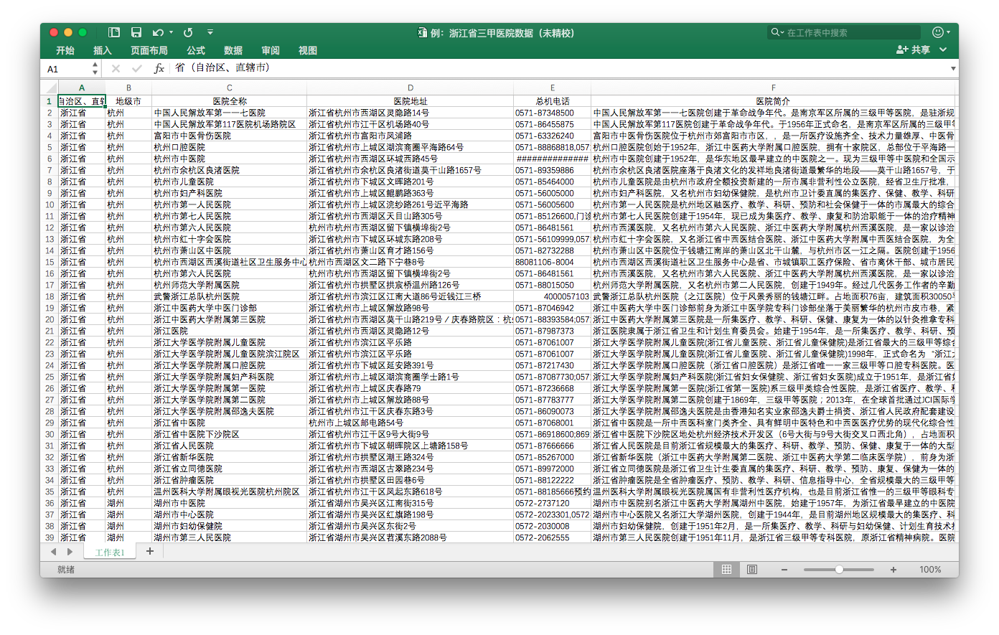

# 「百度医生」三甲医院数据爬取计划

**致谢：**感谢孔哥@FieldSoft-HelloClyde 的帮助，Java 方面由孔哥代劳并辅导:sunglasses:）

**更新：**

> 百度医生关停公告

> 关停时间安排如下：

> 2017年3月10日起，停止提供预约挂号、快速咨询、专家咨询服务，同时下线第三方提供的其它所有服务，之前生成的有效订单可正常使用；

> 2017年3月24日起，积分商城关闭，积分余额将无法使用；

> 2017年3月31日起，停止提供查询功能，包括历史订单、健康档案等所有用户记录，请您务必在此之前自行留存重要数据，以免损失；

> 2017年4月1日，产品正式关停并清空数据。

## 简介

中国医院采用“三级十等”来划分级别。从低到高分别是“一级丙等、一级乙等、一级甲等、二级丙等、二级乙等、二级甲等、三级丙等、三级乙等、三级甲等、三级特等”。“三级特等”极少，因此归入“三级甲等”，可以说“三甲”医院就是最高级别的医院。（此外需要注意，部分医院为了对外宣传，常在主页上将“三乙”“三丙”级别的医院称作“三级”医院，他们不是“三甲”，请注意！）

自从魏则西事件以来，出于兴趣想爬取一份全国三甲医院名单。经过初步调研，有如下几个数据库：

* [国家卫计委（原卫生部）](http://www.moh.gov.cn/)入口的官方全国数据库 - [中国医院等级查询系统HQMS](https://www.hqms.org.cn/usp/roster/index.jsp)。
    * 数据库虽写着“医院信息来源截止至XX年XX月XX日”，但其实该日期总为系统当天。实际比对发现已经比较过时（例如，与黑龙江省卫计委独立提供的官方数据相比，缺失近1/3三甲医院）。
    * 不新、不全、不含部队医院和中医院（似乎不归卫计委管辖）。

* [A-hospital 医学百科](http://www.a-hospital.com/w/%E9%A6%96%E9%A1%B5) - [全国三甲医院名单](http://www.a-hospital.com/w/%E5%85%A8%E5%9B%BD%E4%B8%89%E7%94%B2%E5%8C%BB%E9%99%A2%E5%90%8D%E5%8D%95)
    * 仿维基百科式的数据库，界面较为直观清爽。
    * 抽检发现仍有误，但未具体统计覆盖率和正确率。
    * 由于本人调研时间为2016年05月左右，当时检查该条目的[修订历史](http://www.a-hospital.com/index.php?title=%E5%85%A8%E5%9B%BD%E4%B8%89%E7%94%B2%E5%8C%BB%E9%99%A2%E5%90%8D%E5%8D%95&action=history)，发现2015年8月25日起就未修订过。该条目自2016年7月21日起修订较频繁。但由于是网络百科，网友可自由修订，修订者素质不一，暂时抱谨慎态度。请自行判断。

    > 留言摘录1：“没有了嘿嘿嘿嘿，我不怕封禁，你们回退吧，这个号仅供娱乐一次。”

    > 留言摘录2：“医者！！！不许回复到你的版本，保留我的版本，否则我就会创建多个用户攻击你！！！”

* [百度医生](https://yi.baidu.com/pc)
    * 仅就[百度医生的黑龙江省的三甲数据](https://yi.baidu.com/pc/hospital/listpage?zt=self&zt_ext=&pvid=1488893981586337&provId=15&cityId=335&regionId=0)和[黑龙江省卫计委独立提供的官方三甲数据](http://www.hljhfpc.gov.cn/yydj.php)做对比，发现基本符合（有极个别出入、冗余）。
    * **百度出品，本练习基于该数据库，请自行判断可信与否，请谨慎参考。**

**调研时间：**2016年05月

**再次申明：** **本项目代码仅做网络编程学习使用，暂时也不考虑提供结果，对自己爬取的信息造成的生命财产损失须自行负责。**

## 运行

（由于项目人员偏好、水平不一，因此使用的工具语言较杂。:sweat_smile:）

### Java

该部分用于抓取各医院的页面地址。

`.java`源代码位于`./src`下，用`javac`来将其转化成`.class`文件。

注意依赖的`gson-2.5.jar`位于`./lib`下，因此需要用`-classpath`（或简写`-cp`）来指定依赖包位置。

`-d`用于指定生成`.class`文件的位置。
```
$ cd src/
$ javac -classpath ../lib/gson-2.5.jar -d ../bin *.java
```

执行`Main.class`文件：
```
$ cd ../bin/
$ java -classpath .:../lib/gson-2.5.jar Main 
```

生成的结果位于`./url`内：
```
$ cd ../url/
$ ls
hn_hospital_url.txt
```

默认以抓取海南的三甲医院名单为例，更换其他省份需修改`Main.java`中的`provId`值（[地域代码](./ref/地域代码.txt)）；同理如需获取“三级”、“三乙”等，需修改`Main.java`中的`hospitalLvl`值。

### Bash Script

该部分用于批量下载页面，并从页面抓取信息。

根据网址批量下载页面可以使用`wget`:
```
$ wget -i hn_hospital_url.txt
```
需等候一段时间，结束后可以执行提取信息脚本`extract.sh`:
```
$ ./extract.sh
```
**更新：**因页面变动，该脚本已失效，待修复。

### Python

可以用 Python 的 Pandas 来自动提取信息并生成电子表格。

**更新：**待修复。

## 结果



[浙江省三甲医院数据（未精校）](./demo/浙江省三甲医院数据（未精校）.xlsx)

## 其他

**Q：**那全国三甲医院有多少？

**A：**各个数据库显示不同。中国医院等级查询系统HQMS显示约700+，但这个数据不包含军队医院和中医院。百度医生则显示约1300+，各地区分布详见[全国各地三甲医院数目（201605爬虫结果统计）](./demo/全国各地三甲医院数目（201605爬虫结果统计）.txt)，但该数据也已知有若干冗余和错误，且百度医生数据库更新较多，此结果仅供参考。

**Q：**爬取的数据结果有哪些瑕疵？

**A：**

1. **一院多名干扰：**随着发展，医院的全称是不断再改变的，一个医院甚至多达三个名字的情况都不少见。比如哈尔滨医科大学附属肿瘤医院，又叫哈尔滨医科大学附属第三医院，又叫黑龙江省肿瘤医院。有时候会重复。

2. **分院重复：**“XX分院”“XX院区”有时是单独的，有时又并入总院一个条目。

3. **中文简称现象：**如“中医院”和“中医医院”、“黑龙江”和“黑龙江省”在部分条目中会混用，尽管医院本身都有一个切确的名字，但是在这么多医院录入数据库的时候就容易出现偏差。还有“中国人民解放军第二〇五医院”、“第二0五医院”、“第205医院”混用等。

4. **错误现象：**比如误将“三级”医院误列入“三甲”名单等。